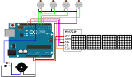

# Mini Piano Arcade Game
Arduino code for a [Grand Piano Keys](https://www.baytekent.com/grand-piano-keys/) inspired mini arcade game.

Code is written for and tested on an Arduino Micro and Arduino Uno R3.

Forked from https://github.com/tasty-cakes1/piano-game.

## Gameplay

These are the original instructions. I've stricken parts that I haven't
confirmed or used in my implementation.

Press any key to start the game. ~~A countdown will appear on the 7-segment
display, and then the game will start.~~ Hit the key with the corresponding bar
displayed above it. You have 1 minute to hit as many keys as possible. If you
press an incorrect key the display will flash for a moment, and the time will
continue to count down. You are unable to accrue more points while the display
flashes.

~~The 7-segment display shows your score (# of keys pressed).~~ When the time is up,
your score will flash. The display will show "High Score!" if you placed in the
top three high scores. You will then be able to enter your initials using the
left 3 keys to cycle through the alphabet for 3 characters. Once your initials
are input, press the rightmost key to submit your initials.

~~When idle, the display will cycle through the top 3 high scores and their
corresponding initials. To reset all of the high scores you can press and hold
all 4 keys for at least 15 seconds while the display is cycling through the high
scores. The display will show "Clear?" after the keys have been held for 10
seconds and then "Clear!" after 5 more seconds.~~

## Dependencies
1. ~~[Adafruit LED Backpack Library by Adafruit](https://github.com/adafruit/Adafruit_LED_Backpack)~~ I didn't use this.
2. [MD_MAX72XX Library by majicDesigns](https://github.com/MajicDesigns/MD_MAX72XX)
3. `pitches.h`

These libraries are available for download through the Arduino IDE Library Manager.

## Wiring

## Materials
1. 4 Brown Cherry MX Key Switches
2. 4 [MAX7219 Dot Matrix Module](https://www.aliexpress.us/item/2255800945325764.html)
3. ~~[0.56" 4-Digit 7-Segment Display](https://www.adafruit.com/product/881)~~ did not use
4. [Elegoo Uno R3](https://www.elegoo.com/products/elegoo-uno-r3-board)
5. M2 screws and nuts
6. [3D-Printed Parts](https://www.thingiverse.com/thing:5761761)
7. Piezo buzzer
8. Diode
9. 100Ω resistor
10. Bamboo skewer
